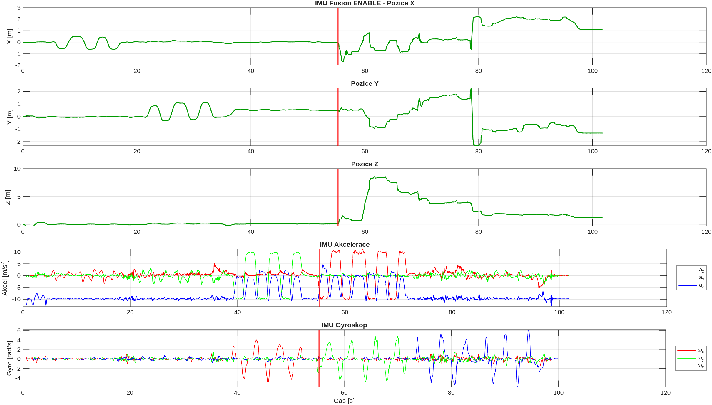
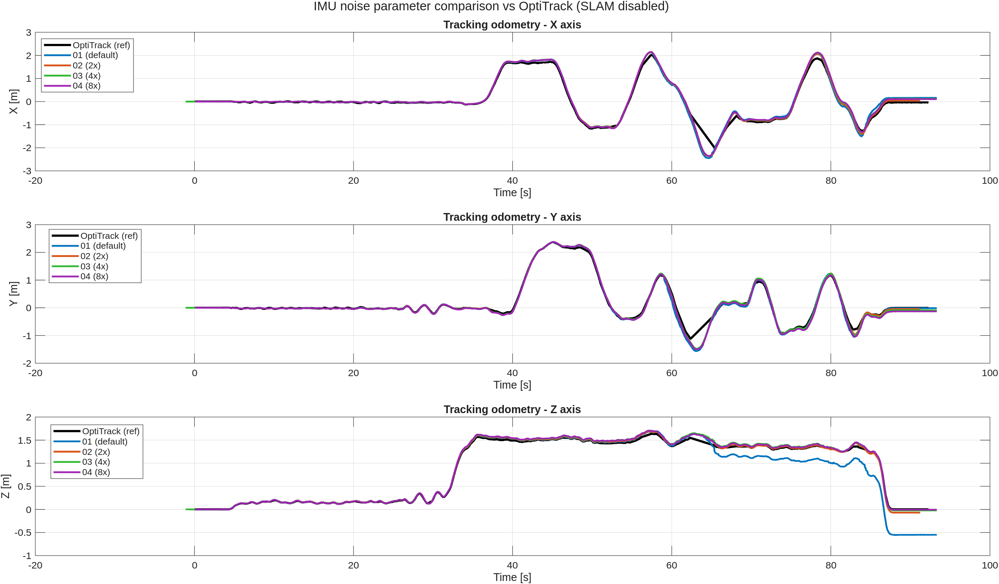
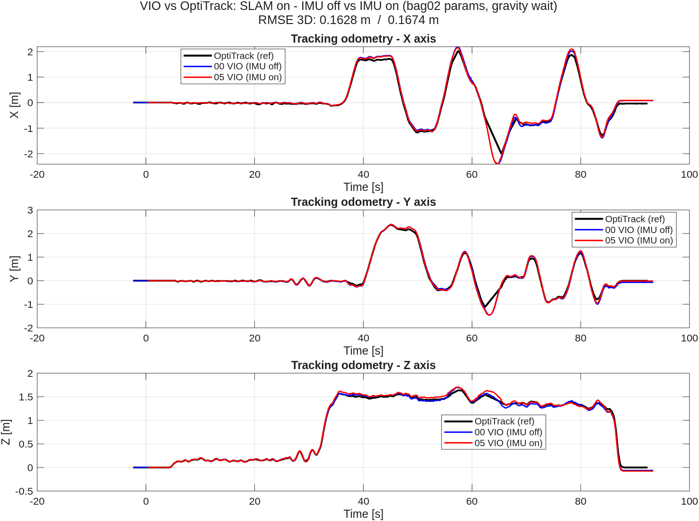

# IMU Data Fusion

When I first tried the algorithm with IMU fusion enabled, it was very error-prone and the algorithm works more efficiently without it.

## Data Preparation

- I performed IMU noise characterization measurements. I used the [Allan ROS2](https://github.com/CruxDevStuff/allan_ros2.git) package. The results are in the f450 configuration file.

- An accurate camera-to-IMU transformation was obtained from the fusion model, where the IMU frame is considered to be the `base_frame`.

- The axis orientation was adjusted to match the ENU coordinate system convention.

## Flight 11.02.2026 (indoor)
Flight with motors off (the drone was held by hand) so that the IMU data would be easy to evaluate. During the flight, I gradually moved the drone along individual axes, first to test the accelerometer and then to test the gyroscope.

The recorded data are evaluated in MATLAB using the `imu_fusion_compare.m` script.


*IMU Fusion ENABLE - position, acceleration and gyroscope timeline*

The figure shows all three axes of VIO odometry over time. During the accelerometer test, the problem with jerky odometry did not manifest. An interesting moment is highlighted by the red line — during the gyroscope test on the y-axis, an unknown error occurred which caused the VIO to fail. From that point on, the computed odometry no longer makes sense.

### Conclusion

- The IMU axis orientation is correct (verified against the camera image).
- The error cannot be conclusively determined from the data, because at the marked moment the RealSense camera was pointing towards the ceiling lights. It is therefore possible that the algorithm simply prioritized the IMU data at that time, which could have also happened at other moments.

## Gravity Vector

A discussion [forum post](https://forums.developer.nvidia.com/t/imu-fusion/316150) states that:

- The gravity vector arrow first appears after successful initialization (camera-to-IMU alignment), which takes 10-20 seconds of camera movement. From this point on, IMU fusion runs continuously.
- The gravity vector arrow reappears when visual tracking is lost and the algorithm subsequently re-aligns the camera and IMU after tracking is restored.                           

After inspecting the gravity error, I discovered that the gravity vector was inverted (pointing up [0 0 9,81]).

## [REP145](https://www.ros.org/reps/rep-0145.html)
ROS2 convetion for IMU.

- When the device is at rest, the vector will represent the specific force solely due to gravity. I.e. if the body z axis points upwards, its z axis should indicate +g. This data must be in m/s^2.

- The rotational velocity is right handed with respect to the body axes, and independent of the orientation of the device. This data must be in rad/s.

I fixed the IMU data based on this convetion and it looks like it works.

## Flight 22.1.2026 (outdoor)
Regular flight behind FEEC. Not sunny day.

Compare two flights with imu and without (slam disabled).
- imu_disabled_slam_disabled_00
- imu_enabled_slam_disabled_00

The recorded data are evaluated in MATLAB using the `tracking_odometry_compare.m` script. Time alignment between the two flights was performed via cross-correlation of GPS odometry (the same recorded GPS data was replayed in both bags).

Tested with this IMU noise parameters (measured)

```bash
    gyro_noise_density: 0.00012975667792863518
    gyro_random_walk: 6.515000786205241e-06
    accel_noise_density: 0.001457588076418319
    accel_random_walk: 0.0002895559589895292
    calibration_frequency: 90.0
```


*Tracking odometry comparison - IMU disabled vs IMU enabled (SLAM disabled)*

Drift from origin (end position vs start position):

| | Absolute | X | Y | Z |
|---|---|---|---|---|
| **IMU disabled** | 0.4663 m | -0.3493 m | 0.2943 m | 0.0936 m |
| **IMU enabled** | 3.1404 m | -0.6384 m | 3.0748 m | -0.0022 m |

### Conclusion

By inverting the accelerometer axis, the IMU data was successfully fused into Isaac ROS Visual SLAM. However, the results show that the odometry is still significantly more accurate without IMU fusion — the absolute drift with IMU enabled (3.14 m) is nearly 7× worse than without it (0.47 m), with the majority of the error concentrated in the Y axis.

### Next steps

- Adjust IMU noise parameters (`gyroscope_noise_density`, `gyroscope_random_walk`, `accelerometer_noise_density`, `accelerometer_random_walk`) in the launch file to improve the IMU fusion accuracy.

### Next tests with the same flight

- imu_enabled_slam_disabled_01 (same parameters as for realsense IMU)
```bash
    gyro_noise_density: 0.000244
    gyro_random_walk: 0.000019393
    accel_noise_density: 0.001862
    accel_random_walk: 0.003
    calibration_frequency: 90.0
```

- imu_enabled_slam_disabled_02 (2x worse)
```bash
    gyro_noise_density: 0.0005
    gyro_random_walk: 0.00004
    accel_noise_density: 0.004
    accel_random_walk: 0.006
    calibration_frequency: 90.0
```

- imu_enabled_slam_disabled_03 (4x worse)
```bash
    gyro_noise_density: 0.001
    gyro_random_walk: 0.00008
    accel_noise_density: 0.008
    accel_random_walk: 0.012
    calibration_frequency: 90.0
```

- imu_enabled_slam_disabled_04 (8x worse)
```bash
    gyro_noise_density: 0.002
    gyro_random_walk: 0.00016
    accel_noise_density: 0.016
    accel_random_walk: 0.024
    calibration_frequency: 90.0
```


*Tracking odometry comparison - IMU noise parameters 01-04 vs IMU disabled (SLAM disabled)*

It was observed that the IMU fusion actually starts working approximately 45 s after launch. This can be identified by the VIO node starting to publish the gravity vector topic.

Drift from origin (end position vs start position):

| Bag | Absolute | X | Y | Z |
|---|---|---|---|---|
| **01** | 1.4699 m | -0.9108 m | 0.9879 m | -0.5960 m |
| **02** | 0.7249 m | 0.3764 m | -0.2895 m | -0.5477 m |
| **03** | 1.1241 m | 0.3340 m | -0.7510 m | -0.7668 m |
| **04** | 0.5355 m | 0.1736 m | 0.3366 m | -0.3785 m |

### Conclusion

Counterintuitively, the results suggest that worsening the IMU noise parameters leads to lower drift — bag 04 (8x worse parameters) achieved the smallest absolute error (0.54 m), while bag 01 (RealSense default parameters) had the largest (1.47 m). This indicates that the algorithm performs better when it trusts the IMU data less and relies more on visual tracking. Overall, IMU fusion does not appear to be practically usable in the current setup, as even the best IMU-fused result (0.54 m) is still worse than running without IMU fusion entirely (0.47 m).

### Next steps

- Perform additional flights with a waiting period at the beginning to ensure IMU fusion is fully initialized (gravity vector published) before the flight starts.
- Investigate filtering the IMU data before passing it to the algorithm.

## Flight 18.2.2026 (indoor, OptiTrack)

Indoor flight with OptiTrack motion capture system used as ground truth. The recorded data are evaluated in MATLAB using the `optitrack_odometry_compare.m` script. Time alignment between bags was performed via cross-correlation of the OptiTrack data (`/mocap/husky_1`), which is the same continuous recording streamed into all bags.

Tested bags:
- imu_disabled_slam_enabled_00 (SLAM enabled, IMU disabled)
- imu_enabled_slam_disabled_01 (SLAM disabled, IMU enabled)
- imu_enabled_slam_disabled_02 (2x worse)
- imu_enabled_slam_disabled_03 (4x worse)
- imu_enabled_slam_disabled_04 (8x worse)


*Tracking odometry comparison - IMU noise parameters 01-04 vs OptiTrack ground truth (SLAM disabled)*

RMSE vs OptiTrack ground truth:

| Bag | RMSE 3D | RMSE X | RMSE Y | RMSE Z |
|---|---|---|---|---|
| **00 (SLAM on, IMU off)** | 0.1628 m | 0.1326 m | 0.0898 m | 0.0292 m |
| **01 (default)** | 0.2755 m | 0.1565 m | 0.1109 m | 0.1978 m |
| **02 (2x worse)** | 0.1597 m | 0.1254 m | 0.0923 m | 0.0352 m |
| **03 (4x worse)** | 0.1663 m | 0.1307 m | 0.0937 m | 0.0424 m |
| **04 (8x worse)** | 0.1717 m | 0.1316 m | 0.1031 m | 0.0390 m |

Drift from origin (end position vs start position):

| Bag | Absolute | X | Y | Z |
|---|---|---|---|---|
| **00 (SLAM on, IMU off)** | 0.1201 m | 0.0720 m | -0.0725 m | -0.0631 m |
| **01 (default)** | 0.5734 m | 0.1581 m | -0.0119 m | -0.5510 m |
| **02 (2x worse)** | 0.0928 m | 0.0423 m | -0.0436 m | -0.0701 m |
| **03 (4x worse)** | 0.1498 m | 0.1183 m | -0.0893 m | -0.0222 m |
| **04 (8x worse)** | 0.1678 m | 0.1037 m | -0.1318 m | -0.0074 m |

### Conclusion

With OptiTrack as ground truth, the results confirm the previous findings — SLAM without IMU fusion (bag 00) achieves the best accuracy with RMSE 3D of 0.16 m and drift of 0.12 m. Among the IMU-fused bags, bag 01 (RealSense default parameters) performs the worst (RMSE 3D = 0.28 m, drift = 0.57 m, almost entirely in the Z axis). Bags 02–04 (worse noise parameters) all achieve RMSE 3D around 0.16–0.17 m, comparable to SLAM without IMU. This again confirms that the algorithm performs better when it trusts the IMU less.

Bag 02 appears to be the most accurate among the IMU-fused configurations, achieving the lowest RMSE 3D (0.1597 m) and the smallest drift (0.0928 m). For any further IMU fusion experiments, the parameters from bag 02 will be used as the baseline:

```bash
    gyro_noise_density: 0.0005
    gyro_random_walk: 0.00004
    accel_noise_density: 0.004
    accel_random_walk: 0.006
    calibration_frequency: 90.0
```

## Flight 18.2.2026 (indoor, OptiTrack) — SLAM on, IMU on vs off

Follow-up test with SLAM enabled in both configurations. IMU fusion used bag 02 parameters. This time the recording was started with a waiting period at the beginning to ensure the gravity vector was fully initialized before the movement started.

The recorded data are evaluated in MATLAB using the `optitrack_odometry_compare.m` script (Section 3).


*Tracking odometry comparison — SLAM on, IMU off (bag 00) vs IMU on (bag 05) vs OptiTrack ground truth*

Drift from origin (end position vs start position):

| Bag | Absolute | X | Y | Z |
|---|---|---|---|---|
| **00 (SLAM on, IMU off)** | 0.1201 m | +0.0720 m | -0.0725 m | -0.0631 m |
| **05 (SLAM on, IMU on)** | 0.1186 m | +0.0874 m | -0.0150 m | -0.0788 m |

### Conclusion

The results show that VIO with and without IMU fusion performs virtually identically in this indoor test — the drift of both configurations is practically the same (0.12 m vs 0.12 m). This is a promising result, as it means IMU fusion no longer degrades accuracy after proper initialization. However, the indoor environment with motors off does not stress-test the IMU data — the real challenge will be an outdoor flight with spinning motors, where vibration-induced IMU noise may cause the fusion to diverge.

### Next steps

- Perform an outdoor flight with motors running to properly evaluate IMU fusion under real vibration conditions.
- Wait for the gravity vector to be published before starting the movement (same as this test).